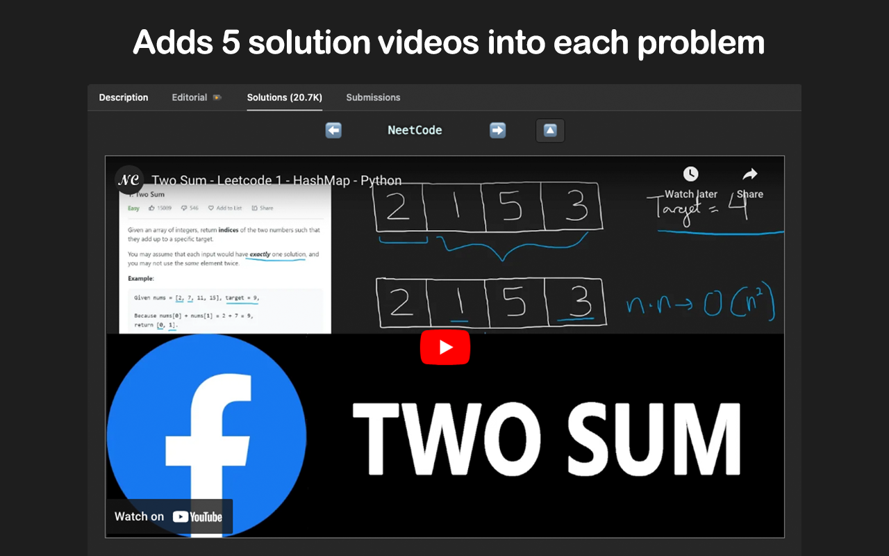
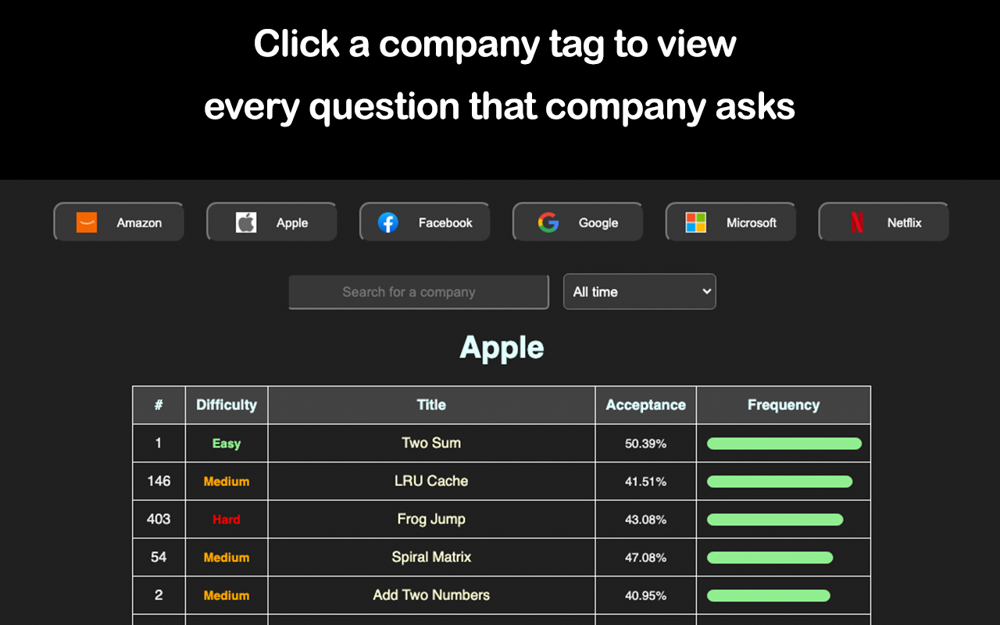
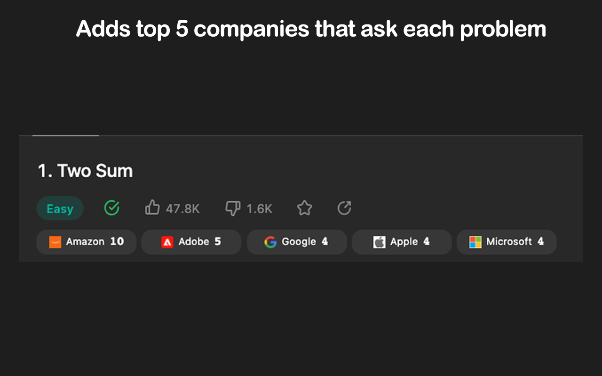
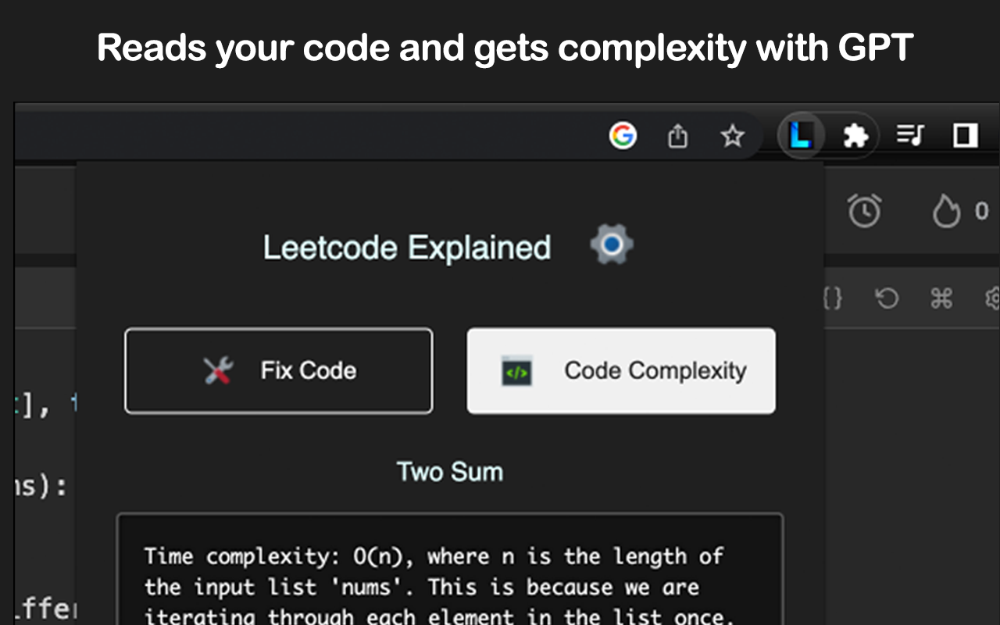
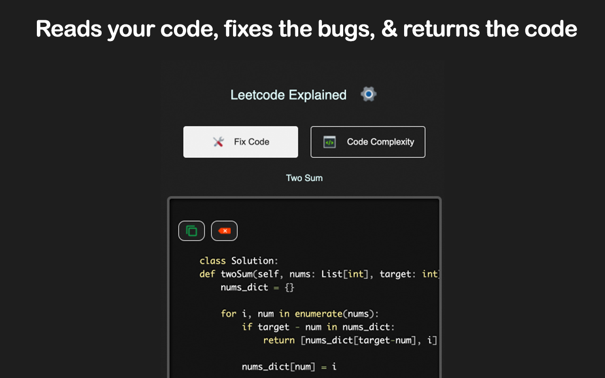

1️⃣ Solution videos: Adds the top 5 youtube solution videos into each [problem](https://leetcode.com/problems/two-sum/solutions)

2️⃣ Company tags: Adds the top 5 companies that ask each [problem](https://leetcode.com/problems/two-sum/description)

3️⃣ Problems by company
Click a company tag to view every question that company has asked in the past 6 months, 1 year, 2 years, and all time. Sort by the date, acceptance rating, difficulty, and more.

4️⃣ Complexity Analysis
Reads your code and gets the time & space complexity using GPT

5️⃣ Code Generation
Reads your code, fixes bugs, and generates the optimal solution code for the given problem using GPT. For more accurate results, open the description tab so GPT can read the problem's description and constraints.

6️⃣ Elo ratings
Adds difficulty ratings into weekly/biweekly contest problems (~1500 added)

7️⃣ Hard Mode
Hide the Leetcode problem examples to simulate a real coding interview environment. Available through the extension's settings.

To activate features 4️⃣ and 5️⃣, log into ChatGPT in your browser and pin the extension

### ⚙️ Installation


1. ``` git clone https://github.com/zubyj/leetcode-explained.git ```
2. ``` cd leetcode-explained ```
3. ``` npm install && tsc```
4. Open Google Chrome and navigate to ```chrome://extensions``` in the search bar.
5. Enable "Developer mode" (top right corner).
6. Click on "Load unpacked" and navigate to the extension directory, then click "Select".
7. Pin the extension. You should now see the extension icon next to the address bar.


### Screenshots








